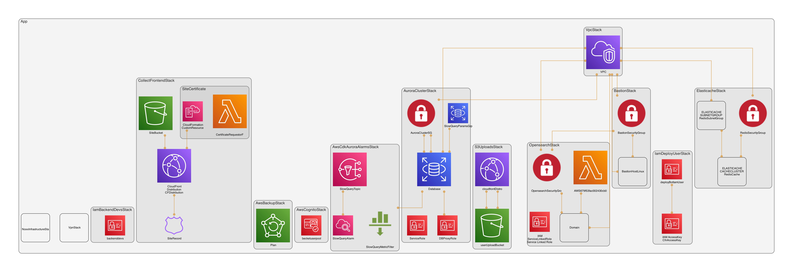

# Global Infrastructure

Hey there. This repo houses the code that builds the Noxx Global Infrastructure.

The various [services that comprise the Noxx Platform](https://github.com/NoXX-Technologies/docs/blob/main/developers/services/README.md) hook into this infrastructure.

## Install CDK

`$ npm install -g aws-cdk`

## Install TypeScript

`$ npm install -g typescript`

## Create a new AWS Sub Account

Note: the profile you use must have `organizations:CreateAccount` permissions in the parent account

`$ aws organizations create-account --email <env-name>@get-noxx.com --acount-name "infrastructure-<env-name>" --profile <profile>`

## Get account number

`$ aws sts get-caller-identity --profile <profile>`

## Bootstrap an environment

`$ cdk bootstrap aws://<account-number>/us-east-1 --profile <profile>`

## Deploying

`$ STAGE=<dev|staging|production> cdk deploy --profile <profile> --all`

## Collect Frontend

If you are creating a new environment (or want to change the domain for an existing environment), you'll first have to purchase the domain from AWS and wait for it to be registered. Then add that domain name to `[environment-config.ts](util/environment-config.ts)`

## VPN

Very few people should need VPN access to the infrastructure resources. In fact, right now, the only use-case is to be able to establish connections to the Aurora cluster from the developers local machine for verifying data imports.

### Creating

In order for the VPN Endpoint to be created, the environment-config.ts needs an ACM ARN. To get this information, [follow these steps](https://docs.aws.amazon.com/vpn/latest/clientvpn-admin/client-authentication.html#mutual) under the "Mutual" section only and then move on to the next step here.

### Using

[See the sections "Downloading and installing AWS Client VPN" and "Exporting and configuring the VPN client configuration file"](https://aws.amazon.com/blogs/database/accessing-an-amazon-rds-instance-remotely-using-aws-client-vpn/) starting from step 7: "Downloading and installing AWS Client VPN"

When prompted to export the config, you'll need to get the vpn id from the platform team and include the correct profile for the environment you're working with (dev, staging, production). Note - if you haven't set up that profile using the steps earlier, this will not work.

````
aws ec2 export-client-vpn-client-configuration \
--client-vpn-endpoint-id "cvpn-endpoint-xxxxxxxx" \
--output text > myclientconfig.ovpn \
--profile noxx-<ENV>
````

You'll need a .crt and .key file

## Overview

- [Timeline and Goals](https://docs.google.com/spreadsheets/d/11EZpMwBINrwbvLawncP47e5jE4AiuK7G1mOnHFt0rGw/edit#gid=0)
- Diagram
  
- [Database Schema](https://dbdiagram.io/d/631f938d0911f91ba591ff92)
  

### Auto-generated ERD

To regenerate the ERD, run the following:

- `$ STAGE=<dev|staging|production> cdk synth --profile <profile> --all`
- `$ npx cdk-dia`


